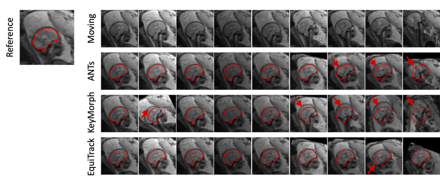

# EquiTrack

In this repository, we present EquiTrack, the first method to use recently proposed SE(3)-equivariant group-CNNs 
(G-CNN) for rigid motion tracking in 3D medical images. Here we use a hybrid architecture that combines a 
denoising CNN with a G-CNN to decouple the processing of intensity and spatial features. 

Specifically, our framework has three parts (see figure below):

1. A denoiser first removes anatomically irrelevant features (i.e., noise) from the two images to rigidly register.
Effectively, the denoiser maps both inputs to a common noise-free intensity distribution, where the inputs only differ 
by the pose of the represented object. 
2. We then extract expressive features with a G-CNN. Crucially, these features are *equivariant* (i.e., they shift and 
rotate accordingly to the pose of the object), such that we extract the *same* features for both 3D images, up to the 
unknown transform.
3. This rigid transform is estimated by collapsing the feature maps onto their centers of mass, providing us with two
corresponding point clouds, which are registered in close form.

 

 
 

Overall, EquiTrack outperforms classical optimisation-based ([ANTs](https://github.com/ANTsX/ANTs)1) and 
learning-based strategies ([KeyMorph](https://github.com/alanqrwang/keymorph)2) for rigid motion tracking
(see figure below for brain motion tracking in a fetal time series).

 

 

---
### Installation

1. Clone this repository.
2. Get python 3.8.
3. Install all the [required libraries](requirements.txt).

That's it ! You're now ready to use EquiTrack ! :tada:

Note: Our code also relies on the [se3cnn](https://github.com/mariogeiger/se3cnn) repository (based on the work 
of Weiler et al.3), that we include here for convenience.

 

---
### Train and test your own model

This repository contains all the code necessary to train and test your own model. Even though our framework is fully 
differentiable, we do not train it end-to-end, because gradients difficulty flow through the G-CNN. hence we train the 
denoiser and the rest of our framework separately. 

To better explain the training and testing procedures, we have writen corresponding tutorials, which were conceived to
be read in order.

- [1-training.py](scripts/1-training.py) explains how to train the G-CNN with the appended close-form algorithm for 
rigid registration
- [2-training_denoiser.py](scripts/2-training_denoiser.py) shows how to train the denoiser.
- [3-predict_denoiser.py](scripts/3-predict_denoiser.py) illustrates how to denoise volumes. This is for curiosity, as
in practice the denoiser is never used on its own.
- [4-predict.py](scripts/4-predict.py) shows how to combine the previously trained networks into one 
model for prediction of rigid transforms between pairs of fixed and moving volumes.
- [5-predict_time_series.py](scripts/5-predict_time_series.py) enables to perform rigid motion tracking in input 
time-series. This is a modified version of script 4 to register all time frames to the first one of the time series.

 

---
### Citation/Contact

This code is under [Apache 2.0](LICENSE.txt) licensing.

If you find it useful for your research, please cite:\
*SE(3)-Equivariance for 3D Motion Tracking in Medical Images* \
Billot, Moyer, Hoffmann, Abaci Turk, Gagoski, Grant, Golland \
2023

If you have any question regarding the usage of this code, or any suggestions to improve it, please raise an issue
(preferred) or contact us at: bbillot@mit.edu

 

---
### References

1 *A reproducible evaluation of ANTs similarity metric performance in brain image registration* \
Avants, Tustison, Song, Cook, Klein, Gee \
NeuroImage, 2011

2 *A robust and interpretable deep learning framework for multi-modal registration via keypoints* \
Wang, Yu, Dalca, Sabuncu \
Medical Image Analysis, 2023

3 *3D Steerable CNNs: Learning Rotationally Equivariant Features in Volumetric Data* \
Weiler, Geiger, Welling, Boomsma, Cohen \
Advances in Neural Information Processing Systems, 2018
